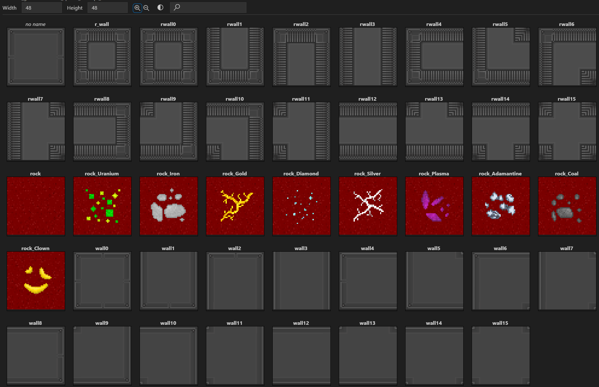

Authored by baloh.matevz and [commited](https://github.com/ZeroHubProjects/ZeroOnyx/commit/e89e470a425bbe493e203edf0ef2a47ecf72f7e2) by SkyMarshal, this is an early attempt at 48x48 sprites for SS13 (which mostly uses 32x32).

The effort didn't go very far, but the files somehow persisted, with this .dmi staying in its unique `icons/48x48/` folder untouched for at least 12 years.