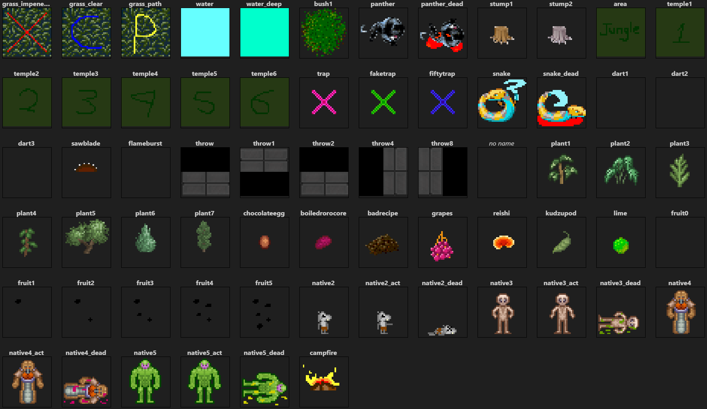

Originally [commited](https://github.com/ZeroHubProjects/ZeroOnyx/commit/d4b3d19793a66539d6df55800b4e72e20c00949d) on Jan 2013 by [Cael Aislinn](https://github.com/caelaislinn), this single .dmi seems to be some starter work on a jungle planet/location/map. Some native alien creatures, some food stuff, some enviornment sprites, some trap sprites and a cozy campfire.

Later, in 2015, the jungle content was removed ([commit](https://github.com/ZeroHubProjects/ZeroOnyx/commit/7c1b70af935ad3dfeb2a612cbdc62d07e182b755)), but the .dmi was still in the game.

The latest recorded change is on Aug 2017 ([commit](https://github.com/ZeroHubProjects/ZeroOnyx/commit/ef946aa0aaf224e21dd17c000c4697c7354c5746)) by [Chinsky](https://github.com/comma) where he added 4 new jungle grass turf sprites.

Could serve as an inspiration to make an alien jungle themed map. And actually, [TatarTheBuilder](https://github.com/TatarTheBuilder) from the [Chaotic Onyx](https://github.com/ChaoticOnyx) community did just that ([commit](https://github.com/ChaoticOnyx/OnyxBay/commit/fb6d119a3d0033e29ab6992ed934ed58a847917b))! No idea if he used the old files/memories as an inspiration, but the map is jungle-themed and was used for some events and regular rounds, with crew accessing the location via the station gateway.
