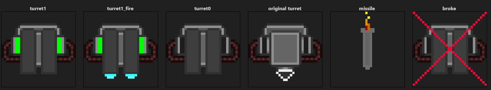

[Added](https://github.com/ZeroHubProjects/ZeroOnyx/commit/c87bb36e90292ead7bf0c487cdaca24dc53e856b) on Aug 2012 by [Cael Aislinn](https://github.com/caelaislinn), this single .dmi has some early sprites for, apparently, "automated turret that shoots missiles at meteors" ([meteor turret commit](https://github.com/ZeroHubProjects/ZeroOnyx/commit/d2d808231e175e6d550ff55dc0178bc89d6698d5#diff-5c0185fa45fb3511de28adcd94405f5c485e74afb9142417f85b3c2b96297038R3)).

Interesting that the `original_turret` sprite from this file is still used in 2024 for upload and telecomms turrets. It can be found in the [icons/obj/turrets.dmi](https://github.com/ZeroHubProjects/ZeroOnyx/blob/963eb4a5a10ca7e644fb38085b76cdb514a2bc16/icons/obj/turrets.dmi) file under `target_name_prism` iconstate name. Given that it's named "original", the sprite itself could be much older than meteor_turret.dmi file.