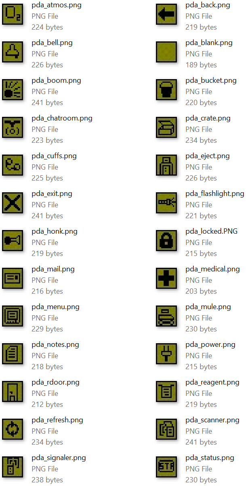

Some quite old and basic icons [commited](https://github.com/ZeroHubProjects/ZeroOnyx/commit/075bbe624e85c5df419eae6b9fa8822972346fbb) by musketstgstation (musketstgstation@gmail.com) on Aug 2010. I'm pretty sure I've seen something similar still being used on goonstation in 2020 or something? Or maybe I'm just confusing things.