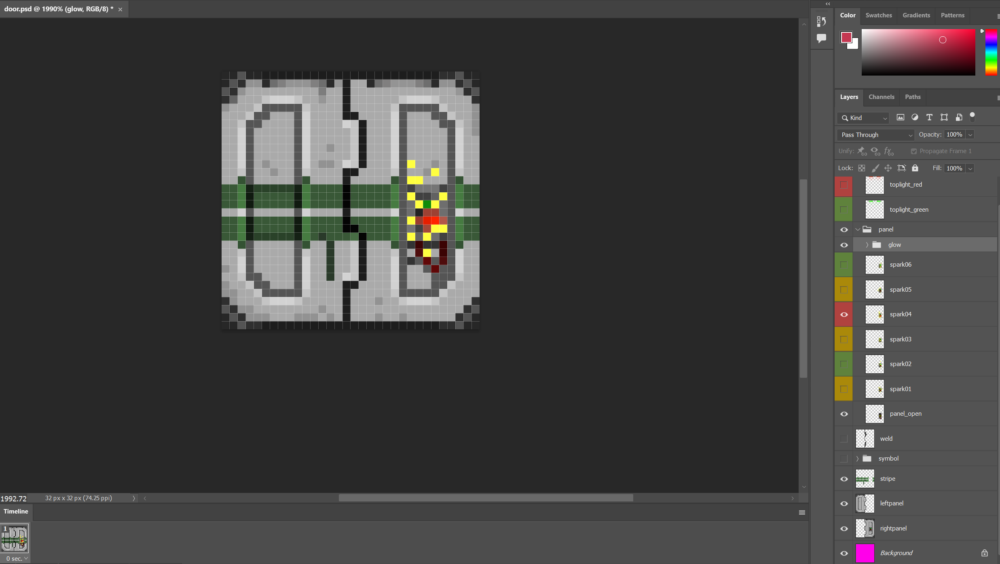

Just a curious historical thing on how airlock (we all know it's just a door, shoutout to all the nerds frothing at the mouth about using the correct "airlock" terminology) sprites were edited and previewed.

Apparently even in 2010 people didn't like DreamMaker's sprite editor all that much and would rather use photoshop, even if it entailed all the importing/exporting hassle, as well as storing the .psd files.

And storing the files in the repository they did! Originally [commited](https://github.com/ZeroHubProjects/ZeroOnyx/commit/662c08272acd7be79531550919f56f846726eabb) by only.lurking on Aug 2010, these files survived at least 14 years inside the `icons/PSD files/` folder, much longer than they were actually used.

There's also `asteroiddustoverlay.psd`, originally [commited](https://github.com/ZeroHubProjects/ZeroOnyx/commit/a793f1e55a0d3c26eccbdc4ab1abf627d5eadd5e) by petethegoat (petethegoat@gmail.com), but there isn't really much to see in that file. It seems to be just some half-transparent sand texture being overlayed over a plating icon.