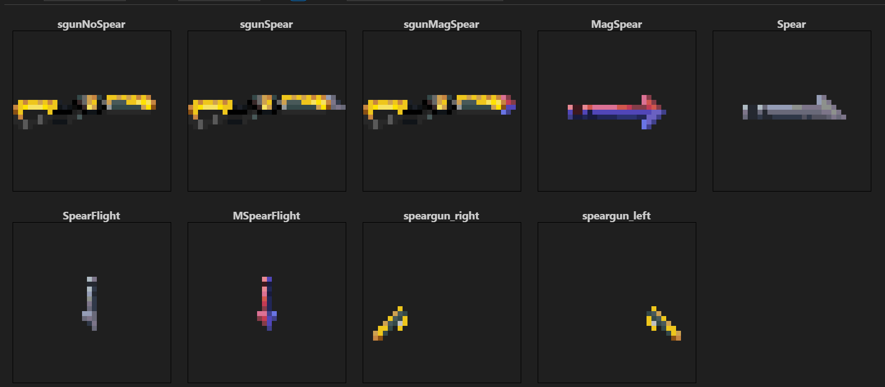

Combined .dmi of speargun sprites that were [commited](https://github.com/ZeroHubProjects/ZeroOnyx/commit/28d717f6cda60145d0c34780518b44e8f9df7509) on Sep 2017 by Cheridan (https://github.com/Cheridan), logged in the commit history as  d_h2005@yahoo.com.

The sprites themselves aren't his apparently, but were added on the behalf of "Urist" who was "laaaaaaaaaaazy and didn't wanna do it himself", which is stated in the commit message. The mentioned "Urist" is most likely Uristqwerty (https://github.com/Uristqwerty), who shows up in the older commits as Uristqwerty@gmail.com.

Unfortunately, I wasn't able to find any functional speargun code, either because it was never implemented/released, or because it wasn't properly linked to the sprites.

By 2024 only "ammo" and "projectile" icon states were still present in the game files, and were [removed](https://github.com/ZeroHubProjects/ZeroOnyx/commit/f8bd474bad4fedab03c0b9bb8efa566b2bd34691) from ZeroOnyx on Dec 12.